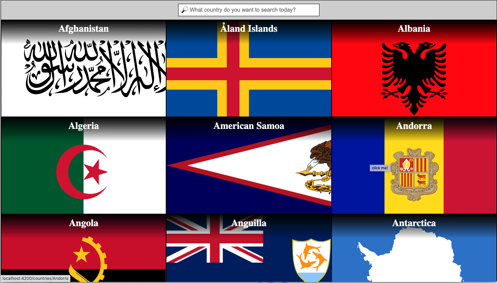

# Country Picker
>  🔎 Find the country you want with ease.

[`Demo`](https://vinhnghi223.github.io/country-picker/)



## Running the app

Below are some useful commands:

Install dependencies
```bash
npm install
```

Running the app locally
```bash
npm start OR ng serve
```
Navigate to `http://localhost:4200/`. The app will automatically reload if you change any of the source files.

Run unit testing
Execute the unit tests via [Karma](https://karma-runner.github.io).
```bash
npm test OR ng test
```

Build the project
```bash
npm build
```
The build artifacts will be stored in the `dist/` directory.

## Features
* Display a list of all countries if search is not requested (search text input is empty)

* Filter countries by entering full or partial country name into search text input

* See country detail (master-detetail UI pattern) either by:
  - selecting country from the list 
  - manipulating direct url on browser search bar

* Support accessibility and responsive layout

* Search with debounce time, and only distinct search text is taken into account

* Requests are only called when needed

* Reactive programming and essential unit testing for services logic